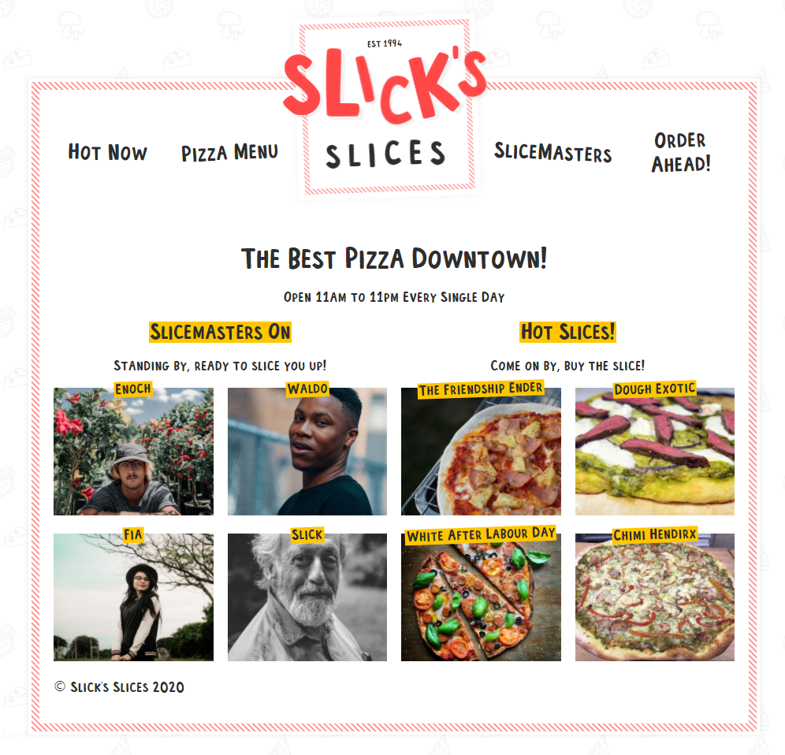

# Pizza Shop

This project was created to dive deeper into gatsby and learning about JAMstack through following [Wes Bos's Master Gatsby course](https://mastergatsby.com/) course

> Pizza ordering platform built as a JAMstack with Gatsby and Sanity.io

Check out the shop here >> https://pizzastores.netlify.app/

## Features

- Single page application
- React hooks, custom hooks and context
- SEO + meta tags
- Serverless functions for emailing orders
- Order Form
- Progressive Images
- Sourcing data through graphQL and Rest API

## Tech Stack

- Gatsby (Frontend)
  - Static Site Generator
- Styled component
  - CSS styling
- Sanity.io (Backend)
  - Headless CMS